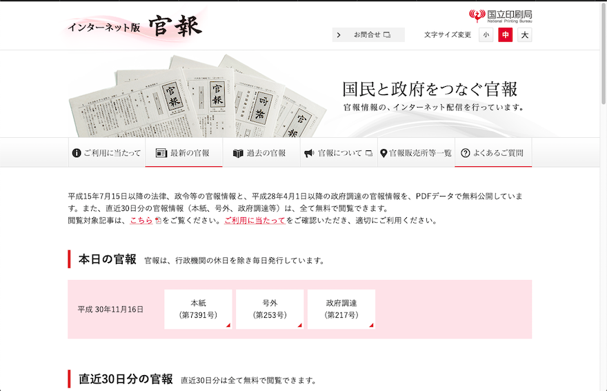
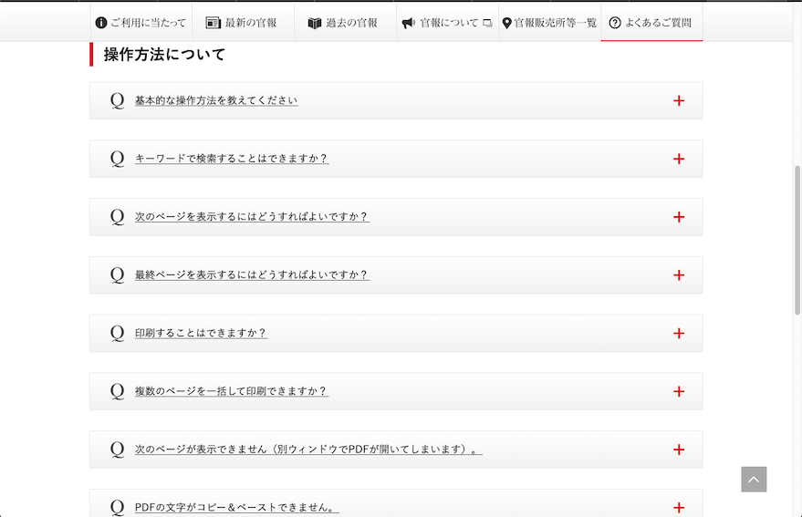
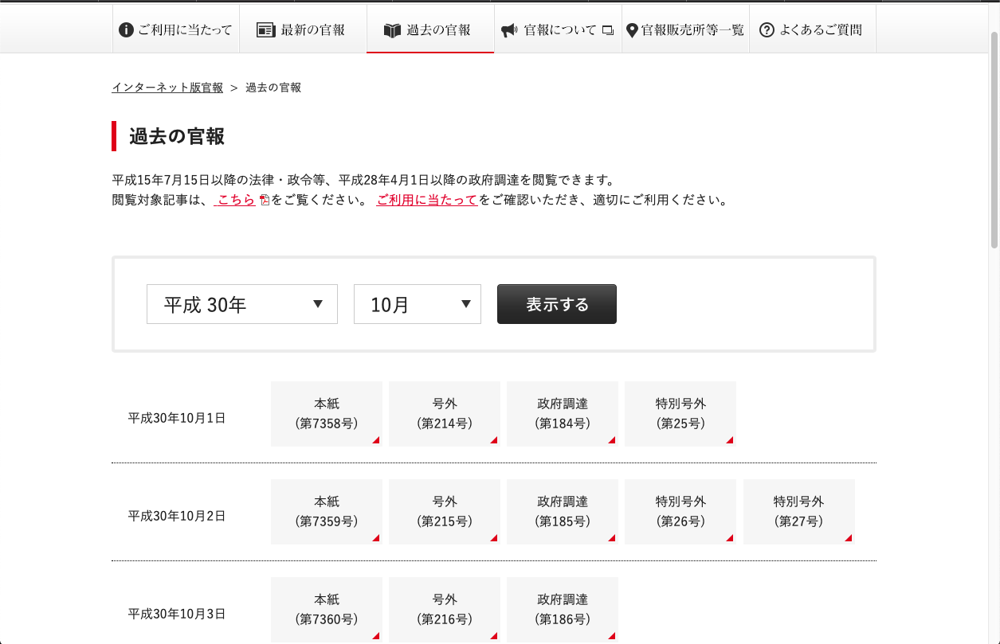
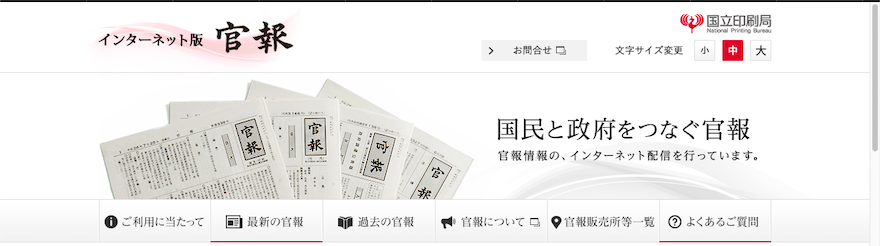
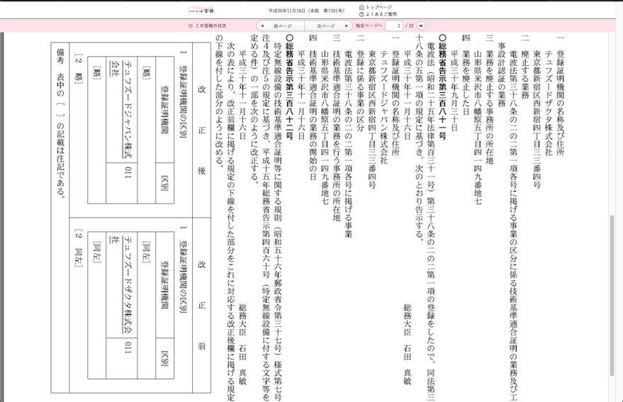
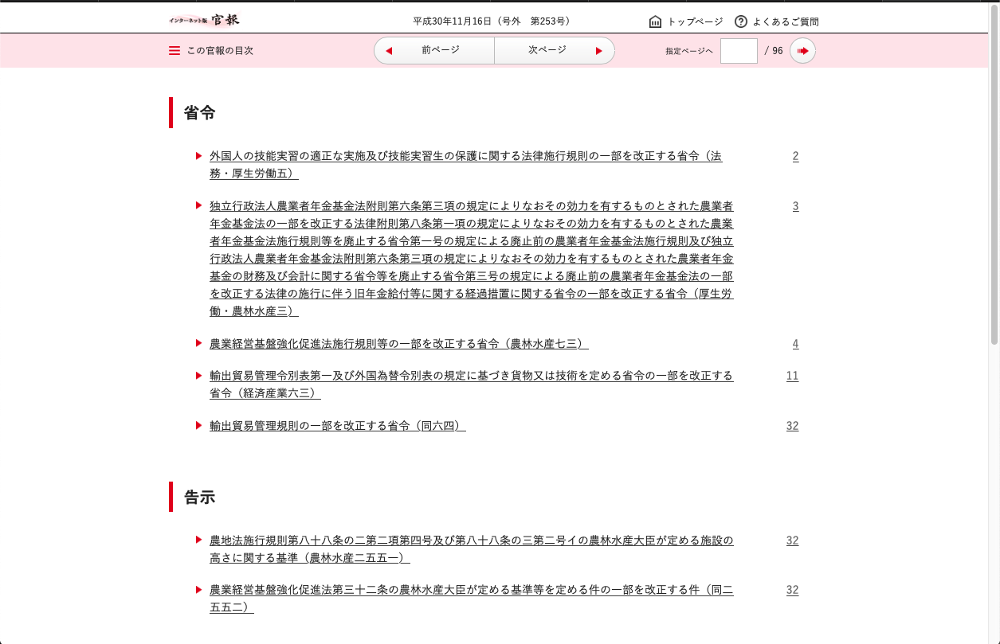

<link rel="stylesheet" href="../common.css" type="text/css"/>

# インターネット版官報
国が運営している情報サイトなら、きっと最低なデザインの塊に違いありません。楽しみです。

[-->トップページ](../README.md)

## サイトの概要

官報を知っていますか？  
「官」とは役所のことですから、「役所からの報(しら)せ」です。役所が何か国民に周知したいことがあれば、官報で報せます。他にも、民間企業から大事な報せを流したい時に利用することができます。

大事な報せを書く唯一の媒体なのですが、誰も存在を知りません。法律の改正(改悪)は、官報でしか報されませんが、誰も知らないがために、誰にも認識されません。

国は馬鹿ですが、能力もゼロではありません。もっと官報を読んでもらえるように考え出したのが、官報のインターネット版です。なぜかスマートフォンは非対応ですが、一応サービスはあります。今回のサンプルは、そのインターネット版官報です。

## レビュー
#### 基本的にこの画面からスタートします。

国民と政府をつなぐんだそうです。写真にあるのが本物の官報ですが、見たこと無いですよね。役所に行けばあるという建前ですが、私が行く役所ではいつ見ても品切れ状態です。

メニューバーまでは普通に見えます。意外と罠があるので後述します。  
メニューバーの下に書いてあるのは、このサイトでできることとできないことの注意書きです。この文章が分かりづらい。ページの頭でしっかり読めと主張している文章が読めたものでは無いのだから、お役所仕事とは恐ろしいものです。

書いてあることは、実際に残っている資料を電子化したものは閲覧できるし、閲覧できるものは全て無料だということです。税金で運営しているのだから無料に決まっています。

次が本題で、アクセスした日の官報へのリンクです。役所の休日には官報も出ません。平日の朝10時頃にはだいたい更新されています。年度替わりの忙しい時期には、やけに多くのリンクを並べて威嚇してきます。

最後に直近30日分ということで、30「通」ではなく30「日分」の官報へのリンクがあります。無料アピールがウザいです。

#### 寄り道してFAQを見てみましょう。

一発目が「基本的な操作方法」です。私はこのやり方が嫌いです。操作方法について本当によく聞かれるのなら、ユーザビリティーが低い証拠ですから、デザインを根本的に見直して速やかに修正するべきです。少し説明すれば分かるというのなら、その説明を、その説明が必要とされる場所で、その説明を必要とする人に、何も教えなくても分かる状態で表示するべきです。FAQで当たり前のように操作説明を書いているサイトをよく見かけますが、正気を疑います。

続いてキーワード検索、ページ遷移と来ます。これは基本操作ではないのでしょうか。もう意味が分かりません。

というのも、このデザインは政府に始まるテンプレとなっていて、WEBに限らずあらゆる場面で役所が多用しているものです。  
何も考えないで分かりづらく使いづらいものを作ってから、FAQと称してイチから説明します。その証拠に、今日から運用すると言われて開いた資料に、FAQが既に数十件載っているのが通例です。誰の質問なんでしょうね。

#### ついでに官報についてのリンクを見ましょう。

メニューバーアイコンの右にあった四角は、別のサイトに飛ぶという意味だったようです。想像しづらいです。このページを開いて初めて「国立印刷局」という文字を見た気になった人が多いはずです。しかし、最初のページをよく見てください。右肩に同じ文字があります。別サイトでも何でもなかったですね。四角の意味は本当に何なんでしょうか。

このページは見るだけで閉じておきます。

#### 過去の官報を検索するページもあります。

画像はあえて原寸大です。本文の文字サイズに対して、検索条件の文字サイズが尋常ではなく大きいです。重ねて言いますが、スマートフォン非対応です。タッチパネル対策ではあり得ません。本文の文字は小さいので、老眼対策でもないでしょう。どういうセンスであればここだけ大きくするというデザインが出てくるのか。

#### 最初のページを詳しく見ましょう。

右に注目です。上で書いたように、「国立印刷局」のサイトだということが書かれています。問い合わせのリンクにはあの四角が付いています。予想通り、国立印刷局の問い合わせに飛びます。ここでの関心は、文字サイズ変更という機能です。

このページはインターネット版官報(ネット官報と略すことにする)の、事実上のランディングページです。メニューバーで言えば左から2番目ですが、メインのページです。そこで文字サイズを変更できるわけです。実際、変更すれば見た目が劇的に変わります。そこまでしなくても、というくらい変わります。

問題は、その影響が「このページに限定される」ことです。先ほどのFAQ、過去の検索などのページには反映されません。それにしては、遷移して戻ってきたこのページでは設定が残っています。それはセッション情報として記憶しているという意味です。だったらなぜ他のページでその設定を見ないのか。デザインのセンスが全く理解できません。

#### いよいよ官報の内容です。

本来は新聞のような媒体なので、こうした見出しはありません。目次はあるのですが、項目が見ての通りなので、索引の役目は全く果たしていません。

ここは官報を説明するサイトではないため、見出しの意味までは触れません。法律解説でもないため、項目の意味にも触れません。触れるのはそのデザインだけです。

とりあえず赤いです。安易な「赤」の使用例として最適です。「目立つ＝赤」ということでしょう。そして見栄えがしないからラインでも引いておけばカッコ良く見えるんじゃないかという安易な発想も見え透いています。役所というお堅いものの中でも、政府直轄の独立行政法人であり、旧大蔵省の組織です。センスなどあるわけがない。官報に興味を持ってもらい、日常的に開いてみるくらいの存在にしていきたいなら、こんな雑なことでは駄目です。堅いなら堅いなりに、荘重な説得力のあるデザインの方が受け入れられるのではないでしょうか。

#### 官報の本文を開いてみます。

見出しの中に、普通の人が見て分かるような項目が無いので、比較的意味が分かりそうなものを拾いました。  
「特定無線設備に付する文字等を定める件の一部を改正する件」と言われても混乱するだけですが、法律に慣れた人ならいつものことです。具体的には画像の左半分の話です。

ネット官報の本文は、新聞官報のPDFです。ただの画像PDFなので、コピーできません。保存したければ、モニターのスナップショットをとるか、手で書き写すしかありません。見ての通り言葉遣いが旧弊で難解、文字はびっしり詰まっていて見づらく、メリハリの無い文章が延々と続きます。  
官報には変更を全て記述する必要があるので、量は仕方ありません。文字を詰めるのも紙を節約するためには仕方ありません。しかしそう言うのなら、ネット官報をもっと普及させ、定着させ、紙で発行する規模自体を縮小する努力をしたらどうなのか。部数を大きく減らす代わりに、同じ予算で見やすく読みやすい官報を作ればいい。そういう事業的なグランドデザインも役所では無理なんですね。

#### 最後に面白いものを見せてあげます。

言うまでも無いでしょうが、注目は省令の2番目です。読めますか？　鳥肌ものですが、決して珍しくはありません。こんなものを見せられたら、二度と読みたくないと思うのが自然です。役所って本当に馬鹿です。

## まとめ

強いて言えば、シンプルなのは悪いことではありません。ユーザーに目移りさせるくらいなら、余計なものを排除して見るべきものだけを見せればいい。千利休です。その点だけは評価に値するかもしれません。

役所のデザイン、怖いですね。私の最寄り駅では、道路の拡幅のため商店を一時退避させる施設を役所が造ったのですが、商品を搬入できるエレベーターがありませんでした。役所を信じてはいけません。

いかがでしたか？

---
[-->トップページ](../README.md)
