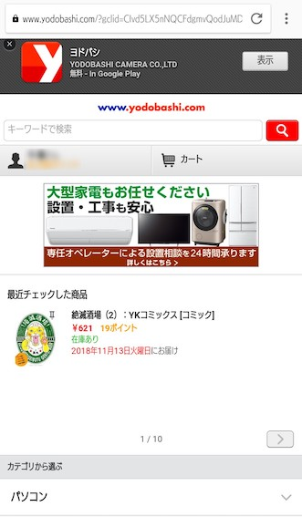
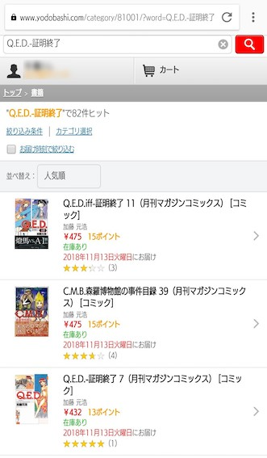
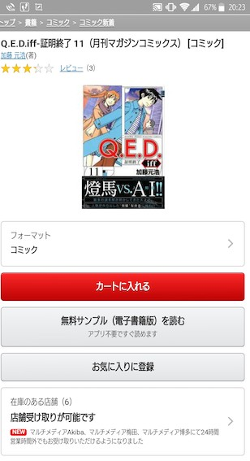
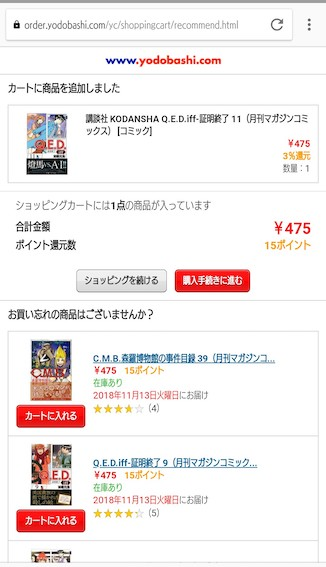
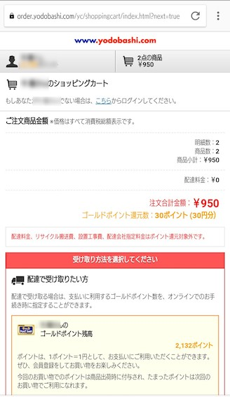
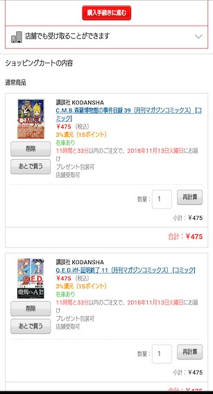

# ヨドバシドットコム モバイル
本を買ってもポイントが付くという戦略に乗っかって、よく使います。それ故に、アラも目立ちます。  
プロの目は「そんなもんだろう」では済みません。「なぜそうなったか」まで考えます。サンプルとしてはいい選択だと思います。

[-->トップページ](../README.md)

## サイトの概要

言うまでもないでしょうが、ヨドバシカメラ直営のWEBショッピングサイトです。  
ヨドバシで扱っている商品なら基本的に掲載されています。価格についてはドットコム価格になっていて、店頭とは一致しません。たまに店頭の方が高かったりした時は、店員に言ったら何とかしてくれたりします。

扱う商品の種類が多すぎて、ほとんどAmazon状態です。従って、商品を探すスキルが無いユーザーには厳しい場所です。目的をハッキリと意識して探さないといけません。それが店頭より難しいとすれば、WEBショップとして成立していないということです。  
どのショッピングサイトにも言えることではあります。

今回のレビューは、そのモバイル版（スマートフォン向け）です。

## レビュー
#### アクセスして最初に開くのはこういうページです。

まず目に飛び込んでくるアプリの広告が邪魔ですね。アプリを使うと買物が便利になるというアピールですが、はっきり言ってアプリは不便です。数分でアンインストールしました。アピールに値するアプリを開発してほしいです。

ショッピングサイトにアクセスするユーザーにとって最も関心が高いのは商品です。検索バーが上部にあるのは当然です。スペースで区切るのも今や常識ですから、プレースホルダーに書かれていなくても困る人は少ないでしょう。  
誰でログインしているのか分かるように、すぐ下にアカウントを表示し、ついでにポイント数も見せる。以前に保留していた商品が無いか分かるように、カートを表示しておく。カートの数字に「0」と表示していれば満点合格です。

大きな問題があります。変な画像リンクがありますね。私はこの時、コミックスを買おうとしていました。専任オペレータによる設置相談については全く関心がありません。邪魔です。  
それならば、この画像リンクに意味があるのはどんな時か。大型家電を購入する動機を持つ人がアクセスしている時です。では、その人がこの画面でこの画像リンクを見る必要があるのか。いいえ。それは実際に大型家電の購入を検討し始めた時、つまり商品を閲覧する時です。そして、今はその時ではありません。

以前に関心を持った商品であれば、関心が続いている可能性があるので、最近チェックした商品のリストを配置するのは妥当です。しかし、なぜ1件だけ？　よく見ると「1/10」と表示されています。10件の候補があるようです。それなのに、あたかも1件しか無いかのように見えます。その理由は、おそらく横スクロールだと思われる表示エリアの、続きがある方向に、何も見えないことです。隠れていてよく分からないけど何かがあるようだ、という見え方をしていないと、あまり注意深くないユーザーは横スクロールを見落とします。  
ヨドバシでネットショッピングするようなユーザーは、みんなリテラシーの高い注意深い人ばかりであり、それ以外のユーザーが困惑しようと、販売機会を逸しようと、別に構わない。それがヨドバシカメラの姿勢だということでしょうか。デザインからはそう読み取れます。

#### 検索してみます。

「q.e.」まで打ち込んだらバーに表示されている候補が現れたので、それをタップしました。合格です。  
件数と条件指定の方法が狭い領域に無理なく表示されています。並べ替えることもできて、並び順の候補も妥当です。  
なのに、気を利かせて関連商品まで見せています、というアピールなのでしょうが、余計なことです。最新刊を探している人以外には無用です。関連商品は実際に開いた商品のページに載っていれば十分です。そして最新刊がほしい人には発売日が最大の関心事です。それが出ていない。  
最新刊がほしい人にしか必要ない情報を表示していながら、最新刊がほしい人なら見たい情報を表示していない。何がしたいのか分かりません。

#### 商品を選びます。

まだ発売日を見せてくれません。ユーザーが全員、正確にコミックスの巻数を記憶していると思っているのでしょうが、私には無理です。  
タイトル、著者、表示画像のセットは今時の常識です。レビューをこの場所に書く理由は不明です。買わない動機にはなり得ても、買う動機にはなりにくい情報です。ユーザーが知りたいのはこういうことではないでしょうか。
- どういう趣味の人に受けているのか
- どのくらい流行っているのか

どちらも購買履歴のビッグデータから導出できます。素人のレビューに頼っておけば、企業努力が不要になると思っているなら、大間違いです。購買意欲を高めるための努力しないなら、他に何を努力するというのでしょうか。

#### カートに入れます。

フィードバックは良さそうです。
- カートに追加というアクションに対して「追加しました」というメッセージ
- 何をカートに入れたのかを明示
- 結果としてカートの状態がどうなったのかを明示

一段飛ばして、関連商品の表示もここに関しては問題ありません。明らかにユーザーの関心に基づいたレコメンデーションです。ただし、ヨドバシの商品には紙本と電子本があります。この表示では、レコメンドがどちらの種類なのか分からないため、希望と違う種類のまま「カートに入れる」をタップする可能性があります。カートに入れた商品と同じ種類をレコメンドしているはずだと信じるならば、多くの場合は問題にならないでしょう。

飛ばした段に戻ります。  
ここは主に「ショッピングを続ける」と「購入手続きに進む」の選択を迫っています。商品を増やすか、このまま決済するかという選択です。最大の問題が、ショッピングを続ける場合の機能デザインです。

「ショッピングを続ける」をタップすると、なんと、カートに入れた商品のページの戻ります。ブラウザーのbackと同じです。そのページを改めて見てみましょう。

ショッピングを続けることを選択したユーザーのネクスト・アクションは何でしょうか。次のいずれでもないことは明らかです。
- 同じ商品の別フォーマットを探す
- 同じ商品の無料サンプルを読む
- 同じ商品をお気に入りに登録する
- 同じ商品の在庫がある店舗を探す

一つだけ、関連商品を探すというアクションは妥当です。それならば、関連商品の表示が先頭に来るべきです。この画面遷移は完全に間違いです。

ショッピングを続けるユーザーの二つめの妥当なアクションは、全く無関係な別の商品を探すことです。上の画面のどこから商品を探せるでしょうか。答えは、スクリーンショットで微妙に切れてしまっている左上の「トップ」というリンクをタップすることです。そうするとトップページが表示され、検索バーが使えます。これもあり得ないデザインです。

どうやら、ヨドバシカメラとしては一点カートに追加したら即座に決済してほしいようです。それにしては、決済し忘れた商品があった時に備えてトップページにカートの表示があります。やはり関西人は商魂逞しいということでしょうか。客とは決済額の数字に過ぎず、買物を、商品を、ヨドバシカメラとの付き合いを楽しむ人間だとは思っていないのでしょうか。

#### そろそろ、買物を終わらせます。

 

画面上部には、決済を試みるユーザーが最も関心を持つはずの金額が表示されていて、ポイント還元数も明示されていて、問題無さそうです。さりげなく送料無料もアピールしています。その後が色々と問題です。

##### 受取方法の選択

金額を確認させると、次に受取方法の選択を迫ってきます。親切のつもりなのだと思いますが、気持ちがデザインに反映できていません。情報の構造はこうなっています。
- 配達で受け取る
  - ポイントの使い方を選ぶ
- 店舗で受け取る
  - 店舗を選ぶ

配達の場合はオンライン決済です。ポイントの消費は決済時点で行われるため、必然的にこの後に続く決済画面でポイント消費数を確定させます。店舗の場合は店舗で決済になるため、ここでポイントについて決定すべき事はありません。  
配達の場合は家に商品が届くため、決済さえすれば終わりです。店舗の場合には店頭に在庫を準備する必要があるため、店舗を選ぶという手続きが必要です。  
この構造自体は妥当ですが、画面のデザインが問題です。二つの関心事を同じ画面で処理させようとするとどんな混乱が起きるか、良い反面教師となっています。

この画面でユーザーが求めているのは、カートをコミットすることです。黙って購入画面へ進めばいいんです。現時点でという注釈付きですが、どうせ送料無料です。配達でも店舗でも決済額は同じです。商品の引き渡し方法は、ここで決めることではありません。

表示エリアのテーマは「受取方法」だと言っています。それにしてはメッセージに違和感があります。
- 配達で受け取りたい方
- 店舗でも受け取ることができます

一貫性がありません。しかも、配達と店舗のメッセージに対する表示面積の割合があまりにも違います。その面積比の違いを生み出している最大の原因はポイント残高の表示ですが、店舗受取のユーザーにとってそれほど重要ではありません。なぜなら、ヨドバシ自らが「配達の場合だけポイントを気にしてくれ」と言っているのだから。いかにも「ぜひ配達を選んでくれ！　どうしてもと言うなら店舗でも構わないが」と言いたげです。

なにせ、ポイント残高はとっくに知っているんです。今も、ページの左上にずっと出ています。モザイクをかけていますが、黄色い文字が分かるでしょう。デザインを犠牲にしてまで、わざわざ二重に出してくれなくていいんです。消しましょう。

実は、店舗でも受け取ることができますの部分をタップすると、店舗選択画面へ遷移するためのボタンが現れます。それを最初から表示していないのも、店舗受取を選んでほしくないという意図を感じます。

配達のエリアにポイントの表示は要らない。店舗のエリアには最初からボタンを表示する。それだけでも大きな改善です。

##### カートの商品

画面の下部には、商品のリストが出ています。追加する度に商品は確認していますが、ここでの目的は最終確認です。意図した商品が、意図した数で入っているか。この画面の目的はカートのコミットです。リストの内容で決済することになるので、意識の高いユーザーはこの瞬間に最も慎重になります。ここにも問題があります。画像が遠いですが再掲はしません。

[-->トップページ](../README.md)
